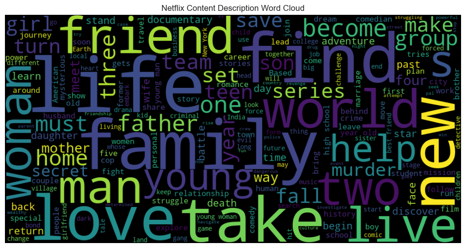

# 🎬 Netflix Data Analysis Project

## 📌 Overview

This project explores a Netflix dataset containing movies and TV shows to uncover insights about content distribution, trends, and patterns.

The analysis includes **data cleaning, exploratory data analysis (EDA), and visualization** using Python.

---

## 📊 Dataset Information

The dataset contains the following columns:

* Show_Id
* Category (Movie / TV Show)
* Title
* Director
* Cast
* Country
* Release_Date
* Rating
* Duration
* Type
* Description

---

## 🧹 Data Cleaning

* Filled missing values in:

  * Director → "Unknown"
  * Cast → "Unknown"
  * Country → "Unknown"
* Dropped rows with missing:

  * Release_Date
  * Rating
* Converted `Release_Date` to datetime format
* Extracted `Year` column for time-based analysis

---

## 📈 Exploratory Data Analysis

### 🎬 Movies vs TV Shows

* Movies dominate Netflix content compared to TV Shows

### 🌍 Top Producing Countries

* United States leads significantly
* India is the second-largest contributor
* Some entries have missing/unknown country data

### ⭐ Ratings Distribution

* Most common rating: **TV-MA**

### 📅 Content Growth Over Time

* Peak content addition year: **2019**
* Significant growth observed after 2015

---

## ☁️ WordCloud of Descriptions

This visualization highlights the most common words used in Netflix content descriptions.

Key Insights

* Netflix has **5374 Movies** and **2398 TV Shows**
* The **United States dominates content production**
* **TV-MA** is the most frequent rating
* **2019** had the highest number of releases
* Rapid growth in content after 2015 suggests aggressive platform expansion

Tools & Technologies Used

* Python 
* Pandas
* NumPy
* Matplotlib
* Seaborn
* WordCloud

Future Improvements

* Build a Netflix recommendation system (Machine Learning)
* Create an interactive dashboard (Streamlit / Power BI)
* Perform genre-based clustering analysis

Conclusion

This project demonstrates how raw data can be transformed into meaningful insights using data cleaning and visualization techniques. It highlights trends in Netflix content and provides a strong foundation for further data science projects.

